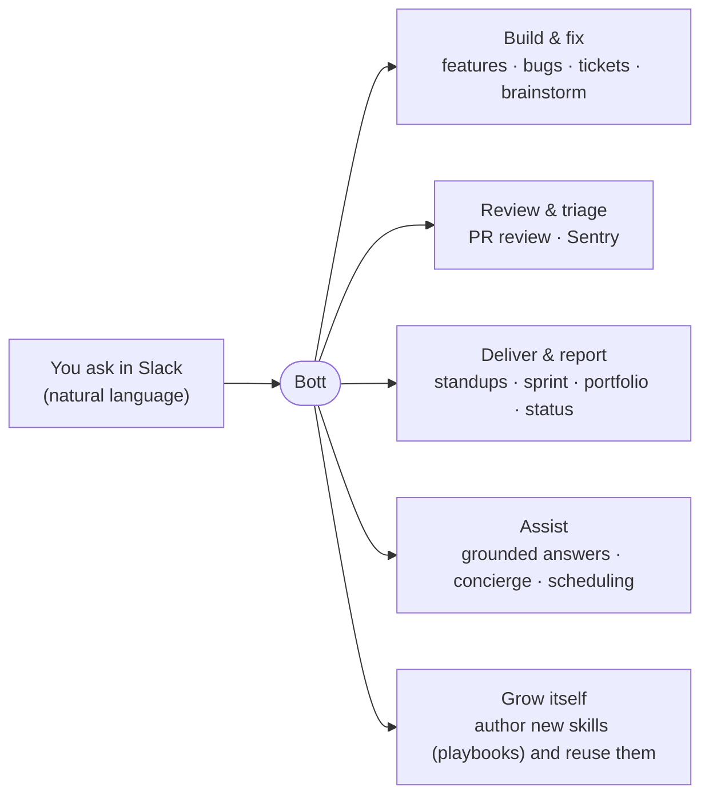
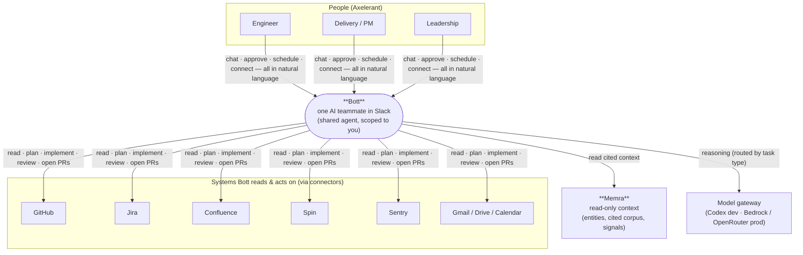
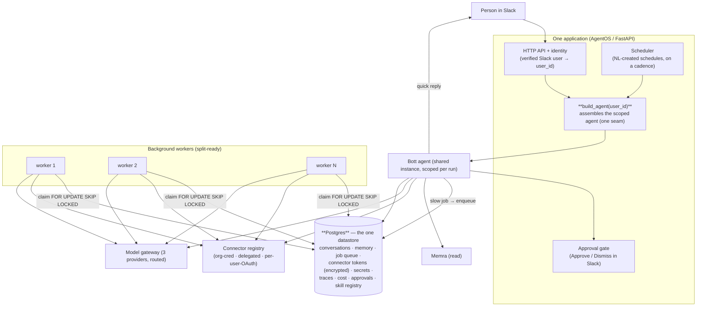
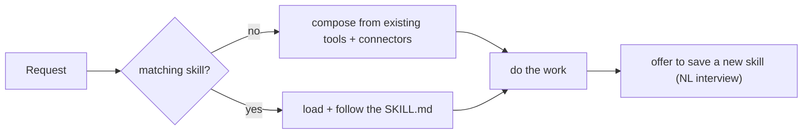
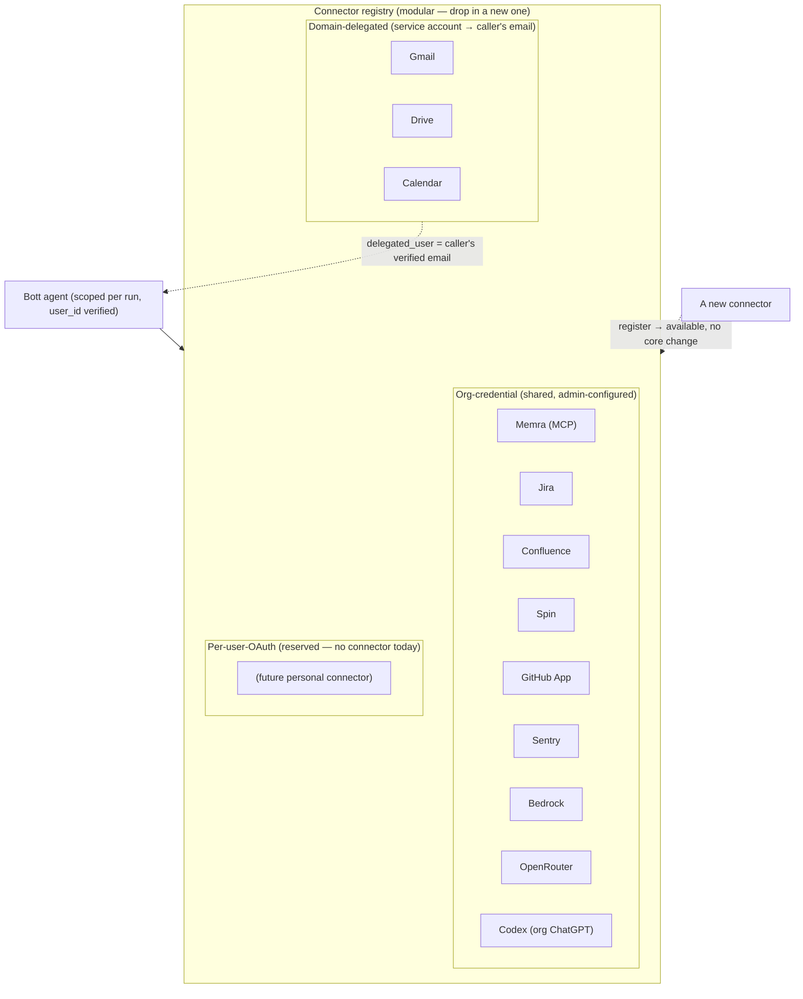
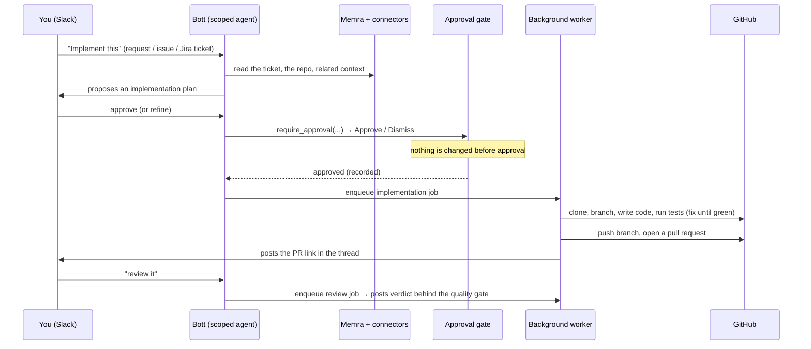
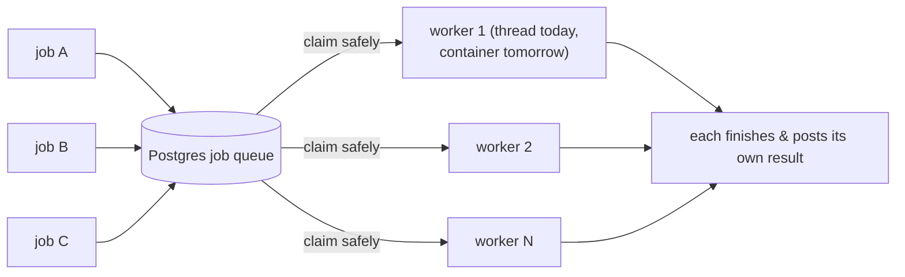
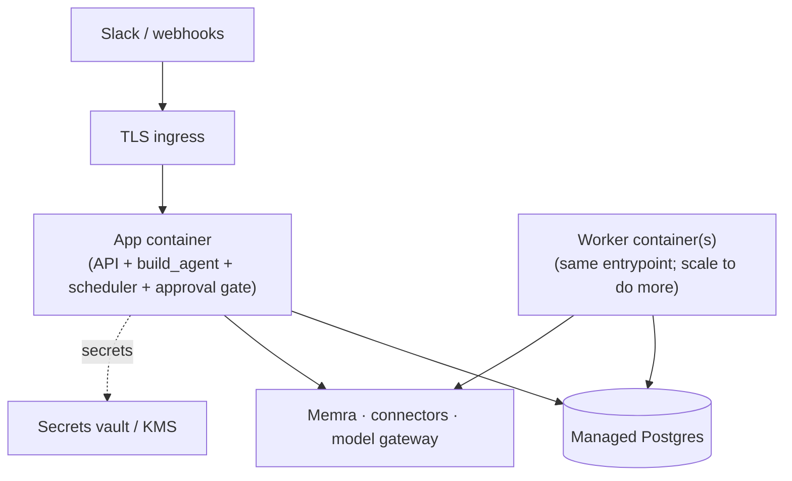

# Bott — Software Architecture Document

- **System:** Bott — a conversational AI engineering teammate for Axelerant
- **Platform:** Agno AgentOS (FastAPI) · Postgres
- **Interface:** Slack today, a management web app later (same backend)
- **Status:** Target-state (production north-star) · **simplified, production-ready**
- **Audience:** engineering, delivery, leadership

> This revises the original north-star toward the *simplest thing that is production-ready*:
> one shared agent with structural isolation (not a rebuild per request), Postgres as the only
> datastore, a split-ready job queue, a **three-provider** model gateway (Bedrock/OpenRouter +
> org-level Codex) with per-task routing, natural-language control of everything,
> a connector system with **three auth patterns** (org-credential / domain-delegated /
> per-user-OAuth), and self-authored **skills** (not executable tools — no code sandbox). Build
> order is **foundation first**.

---

## 1. What Bott is, and what it can do

Bott is **one AI teammate** that lives in Slack. You talk to it like a colleague — in a DM or
by `@mention` — and it does real engineering and delivery work. It is **one Agno agent** (one
personality, one brain) with a library of **skills** it follows, running inside **one
application**. Every person at Axelerant can use it at the same time, and each person only
ever sees their own work.

**Everything is conversational.** Every action — running a report, connecting your Gmail,
scheduling a recurring task, teaching Bott a new skill — happens by *talking to it*. There is
no form you must fill in; buttons exist only as optional convenience.

The goal is a **one-stop teammate**: if you can describe it, Bott can attempt it — and when it
lacks a way to do something, it can **author a new skill** (a written playbook) and reuse it
forever. Skills compose the tools and connectors Bott already has, so a well-written skill can
accomplish most of what a bespoke tool would — with none of the risk of running model-written
code. (Self-authored *executable tools* are intentionally **out of scope** for now — see §11.)

---

## 2. The key ideas (the few decisions that shape everything)

1. **One agent, built per caller.** Not a team of agents, and not a fresh agent rebuilt on
   every message. A single shared agent is assembled through one seam — `build_agent(user_id)`
   — where per-caller scope binds. Isolation is **structural** (every run is scoped); the seam
   can flip to a true per-request factory when the web app arrives.
2. **Postgres is the only datastore.** Conversations, memory, the job queue, connector tokens
   (encrypted), secrets, traces, cost, approvals, and the skill registry all live in one
   database. No separate queue, cache, or broker.
3. **Identity from Slack, never the model.** Every run carries a verified `user_id` and
   `session_id`; all state is queried scoped-by-user; a hard guard refuses any run with a null
   `user_id`. Cross-user access is *absent by construction*, not merely checked for. Crucially,
   per-user connectors bind to that verified identity (whose mailbox / whose token) from
   trusted context — **never** from a value the model can choose (see §9).
4. **Everything is a tool the agent can call, so everything is conversational.** Scheduling,
   connecting accounts, authoring skills — all exposed to the agent, all driven by chat.
5. **One model gateway — three pluggable providers, routed by task.** **Bedrock** and
   **OpenRouter** are the sanctioned production providers; **Codex** (one **org-level** ChatGPT
   subscription, shared) is an opt-in path to frontier models without per-token API billing.
   Within whichever provider, work is routed by type: a fast
   model for chat, a stronger model for heavy work (implementation, review). See §7.
6. **Self-authored skills, not tools.** A **skill** is a written playbook (just text) — freely
   authored, including from a natural-language description via a clarifying-question interview,
   and reused on match forever. Skills compose existing tools/connectors to do almost anything,
   with zero code-execution risk. Self-authored *executable* tools (and the sandbox they'd
   need) are **deliberately out of scope** — the risk/complexity isn't worth it when skills
   cover the need.
7. **It asks before it changes anything.** Reading is free; anything that changes the world —
   opening a PR, pushing code, sending client-facing content — waits for **Approve / Dismiss**
   in Slack, and is recorded after.
8. **Slow work runs in the background, split-ready.** Long jobs run on a Postgres-backed queue
   claimed with `FOR UPDATE SKIP LOCKED`. They run in-process today and split into separate
   worker containers later with no rewrite.
9. **Connectors are a modular registry with three auth patterns.** Every connector declares how
   it authenticates — **org-credential** (shared static secret), **domain-delegated** (one org
   service account impersonates the caller's org email — per-user scope, no per-user login), or
   **per-user-OAuth** (interactive consent, per-user encrypted tokens). Transport is orthogonal:
   a connector can be a native client, an **MCP** server, or a model backend. See §6.

---

## 3. System Context (C4 Level 1)

**In scope:** the Bott application — its agent, skills, tools, connectors, runtime, and data.
**Out of scope (external):** Memra's own ingestion; the external systems; the LLM providers.

---

## 4. How it's built (C4 Level 2 — containers)

- **One application.** A single process hosts the API, the `build_agent` seam, the scheduler,
  and the approval gate. Low operational surface: one app, one database.
- **The agent build seam.** `build_agent(user_id)` is where isolation, connectors, and model
  routing bind. Today it returns the shared agent scoped to the caller; tomorrow it can be a
  per-request factory (web app + JWT) without touching callers.
- **Background workers, split-ready.** Long jobs become a row in the Postgres queue and run on
  a worker. Today the worker is a thread in the app; the *same* `worker_main` entrypoint runs
  as its own container later. Add workers to do more at once.
- **Postgres.** The one datastore — and the job queue. No extra infrastructure.

---

## 5. Skills: how behavior is organized and grown

Behavior lives in a **skill library**. The agent sees its skills, loads the one that matches a
request, and follows it; only when nothing matches does it improvise from the tools and
connectors it already has.

A **skill** is a written playbook (`SKILL.md`): *when to use this, the steps, what to check*.
Skills are the **only** thing Bott authors itself — and that's deliberate. A skill is just
text, so authoring carries zero code-execution risk; and because a skill orchestrates the
tools and connectors Bott already has, a well-written one can accomplish most of what a custom
tool would. (Self-authored *executable tools* — and the sandbox they'd require — are out of
scope; see §11.)

**Bott grows its own skills, by talking:**
- Ask "save this as a skill", *or* describe a workflow in plain language; Bott runs a short
  **clarifying-question interview**, writes the `SKILL.md`, and it's discoverable and reusable
  from then on.
- A **curator** keeps the library healthy — tracks usage, retires stale skills, protects
  pinned ones.

---

## 6. Connectors (one modular registry)

A **connector** gives Bott access to an outside system. There is **one connector system**;
each connector is a self-contained module registered through `connectors/registry.py`, and
**new ones can be added without touching the core**. Each connector declares two things — its
**auth pattern** and its **transport** — which are independent.

**Three auth patterns:**

- **Org-credential** — a shared secret/credential, configured once by an admin (no per-user
  anything). *Jira, Confluence, Spin, Memra, Bedrock, OpenRouter, the GitHub App, and **Codex**
  (one org ChatGPT subscription — an OAuth token connected once by an admin and centrally
  refreshed; §7).* The agent uses the same org credential for everyone — intended shared
  access, not a leak.
- **Domain-delegated** — one org **service account** with Google Workspace domain-wide
  delegation impersonates *the caller's* org email. *Gmail, Drive, Calendar.* This gives
  **per-user scope with no per-user login**: the connector is built per request with
  `delegated_user = <the caller's verified @axelerant.com email>`, so it only ever touches
  that person's data. The admin authorizes the service account once.
- **Per-user-OAuth** — interactive consent, with each user's tokens stored **encrypted
  per-user** and resolved at call time by `user_id`. Reserved for a *personal* connector that
  has no delegation option; **no connector uses it today** (Google uses delegation; Codex is
  org-level). Kept in the taxonomy so such a connector drops in without a new pattern.

**Transport is orthogonal.** A connector can be a native client (Jira/GitHub SDKs), an **MCP**
server, or a model backend. MCP is the unifier: `MCPTools(header_provider=fn(run_context))`
runs a callback *per request* that can read `run_context.user_id` — so one MCP connector is
**org-static** (a fixed header — e.g. Memra with the Memra team's headless credentials) **or
per-user** (the header_provider resolves the caller's token). Same mechanism, both patterns.

**Isolation (the rule that makes "only my data" true).** For both delegated and per-user-OAuth
connectors, *whose* account is touched — `delegated_user`, or which token — is bound from the
**verified Slack identity** (`run_context.user_id`), and is **never** a value the model or a
tool argument can set. A delegation service account is powerful (it *can* impersonate anyone in
the domain), so this binding is the load-bearing guarantee: the connector exposes no "whose
account" parameter, and the two-user isolation gate is extended to prove user B's agent reads
B's mail, not A's. ("What can you connect to?" lists the registry; linking, where needed, is by
talking to Bott.)

> **Note — GitHub auth in the PR-review / build path.** GitHub is an org connector
> *conceptually*, but the PR-review and build flows do **not** reach it through the connector
> registry today. They authenticate with a **GitHub App installation token** (minted per repo
> from the App's id + private key — an org-level, person-agnostic identity that also clones,
> reads, and posts the review as the App). When the App isn't installed on a target repo, the
> code falls back to a single shared **personal access token** (env `GITHUB_TOKEN`, or the
> developer's local `gh` CLI login) — a **dev-only** convenience. For multi-user production,
> ensure the GitHub App is installed on the repos Bott reviews so the App identity is always
> used; folding this auth behind the connector registry is future work. This GitHub-side
> identity is independent of a job's `user_id` (see §9): the App/PAT is *who GitHub sees*; the
> `user_id` is *whose isolation scope the job runs in*.

Delegated connectors need **no** per-user login (the service account is authorized once). The
org Codex credential is connected once by an admin (see §7) — also no per-user login.
Per-user-OAuth (reserved) would need a one-time per-user link. Everything around it is natural
language.

---

## 7. Models (pluggable gateway, routed by task)

The model is built in **one place** (`shared/model.py`), so the LLM is a **configuration
choice, not code**. There are **three providers**, and work is routed by task type — a
fast/cheap model for everyday chat, a stronger one for heavy work (implementation, review):
`build_model("chat")` vs `build_model("heavy")`.

- **Bedrock** *(sanctioned)* — Amazon Bedrock with org AWS credentials. Org-level.
- **OpenRouter** *(sanctioned)* — many frontier models behind one org key. Org-level.
- **Codex** *(opt-in)* — frontier models on **one org-level ChatGPT subscription**, shared
  across the team (decision: org-level, *not* per-user seats). No per-token API billing.
  `build_model(role)` (no `user_id`) uses the one org token for chat and workers alike.

**How the org Codex path works in production (an org-credential connector, §6):**
- **Connected once by an admin.** A live spike confirmed OpenAI's auth issuer advertises **no
  device-code endpoint** and we can't register a hosted redirect on OpenAI's client — so there's
  no slick web login. An admin runs `codex login` on the org account and hands Bott the
  resulting `auth.json` (App Home "Connect Codex" action, or bootstrap from the host's file).
- **Runtime.** Bott stores the org `{access, refresh, account_id}` **encrypted** (one row), and
  a **single-writer TokenManager** refreshes ahead of `exp` against
  `auth.openai.com/api/accounts/oauth/token`, holding a **Postgres advisory lock** so the
  single-use, *rotating* refresh token is never race-invalidated across workers. Inference goes
  directly to the Codex backend with the managed token (an in-process model adapter — no
  per-box proxy to run).
- **Rate limits & fallback.** The org account has one shared limit pool; on exhaustion the
  gateway can fall back to Bedrock/OpenRouter.

> **Honest caveat.** A ChatGPT subscription does **not** include sanctioned API access; driving
> one **org-shared** account through the undocumented `chatgpt.com/backend-api/codex` endpoint
> is the **account-sharing** gray-area variant (shared rate-limit pool, no per-user attribution,
> ban risk). So **Bedrock and OpenRouter are the sanctioned defaults**, and Codex is a knowingly
> opt-in, behind-config cost lever an org enables with eyes open — for now an exploration ("see
> if Codex can solve the use cases that are failing"), not the unattended prod default.

**Control surface — Slack only, no web app.** Selection lives in two layers, both in Slack:
**env provides the default** provider + per-role models at deploy; an **admin App Home "Models"
tab** can override at runtime (persisted to the Postgres `settings` table that `build_model`
reads), and the **active provider/model is always shown** so a switch is never a silent hijack
(the repo deliberately removed an earlier hidden store-override; this reinstates switching only
in *visible, admin-gated* form). The same App Home tab hosts an **admin-only "Connect Codex"**
action: a modal to paste the org account's `codex login` output once (one org connection serves
everyone). So one Slack surface covers both the model choice and the org Codex connection.

---

## 8. How requests flow (runtime)

### 8.1 A normal turn (answer or quick action)
You message Bott → the app verifies who you are (Slack-signed) and derives `user_id` →
`build_agent(user_id)` returns the scoped agent → it picks the matching skill and works the
think-act-observe loop → it replies in the thread. Slow work enqueues a background job (§8.4)
instead of blocking.

### 8.2 Build a feature, or act on a ticket (flagship flow)
Whether the trigger is a plain request, a **GitHub issue**, or a **Jira ticket**, the shape is
the same: **understand → plan → approve → implement → PR → (optional) review.**

The same machinery covers **fixing a bug** (the plan is a fix) and **Sentry triage** (the
trigger is an incident; the plan is the remediation).

### 8.3 Reviewing and triaging
Same pattern as §8.2 without the implement step: read the thing, reason, post a result — a
review verdict, or a triage explanation with a proposed fix. Approve the fix and it flows back
into §8.2.

### 8.4 Many jobs at once (split-ready concurrency)
Each job is a row in the Postgres queue; workers claim rows with `FOR UPDATE SKIP LOCKED`, so
no two grab the same job. Duplicate requests coalesce by `(kind, dedup_key)`; failed jobs
retry within bounds. The worker runs in-process today; deploying the *same* entrypoint as
separate containers scales out with no rewrite — **add workers to do more**.

---

## 9. Safety: isolation and approval

- **Isolation by construction.** Every request is tied to a verified `user_id` (who) and
  `session_id` (which conversation), supplied by Slack — never by the model. `build_agent`
  binds that scope; a hard guard refuses any run with a null `user_id`; every read/write is
  scoped by it. Engagement-scoped work uses a combined engagement-plus-person scope so context
  never crosses engagements.
- **Per-user connectors bind to the verified identity, not model input.** For a
  domain-delegated connector the impersonated email (`delegated_user`), and for a
  per-user-OAuth connector the token, are resolved from `run_context.user_id` — the connector
  exposes **no "whose account" parameter** the model could set. A delegation service account
  *can* impersonate anyone in the domain, so this binding is the guarantee that "Bott reads
  only *my* mail/drive/calendar." Org-credential connectors (Jira/Confluence/Memra) are
  intentionally shared context, not per-user.
- **`user_id` is the actor, not the subject.** It encodes *whose scoped action a run/job is* —
  not who the work is *about*. Human-triggered work (a Slack mention or button) carries the
  triggering person's id. **Automated work that no human triggered** (e.g. a GitHub-webhook PR
  review) carries a distinct, clearly-synthetic system actor — `system:github-webhook` — so it
  loads no one's personal memory and audit can tell automated runs apart. Facts *about* the
  work (the PR's author, title) live in the job payload and the output, never overloaded onto
  `user_id`.
- **Approval before change.** Reading is never gated. Anything that changes the world — opening
  a PR, pushing, deploying, sending client-facing content — is approved by a human (Approve /
  Dismiss in Slack) and recorded after.

---

## 10. Data, cost, and deployment

- **One datastore.** Postgres holds conversations, memory, the job queue, encrypted connector
  tokens, encrypted secrets, traces, cost, approvals, and the skill registry — no separate
  queue, cache, or broker.
- **Secrets.** API keys, connector secrets, and the token-encryption key live behind a
  `SecretBox` abstraction — environment variables in dev, a managed vault/KMS in production.
  Connector tokens and secrets are ciphertext at rest.
- **Cost & audit.** Every model call records tokens and cost; every world-changing action is
  approved and logged; reviews and implementations keep a full trace. Because everything flows
  through one queue and one database, all work is uniformly scoped, gated, audited, and costed.

The app is **host-agnostic**: containerized, one Postgres dependency, secrets abstracted —
deploy to AWS, a single VM, or Kubernetes without a rewrite. The API process and the workers
scale independently because they share only the database.

---

## 11. Build phases

Each phase is delivered and validated on its own. **Foundation first**: the platform is built
and proven before any new capability layers on.

Self-authored *executable tools* and a code sandbox were considered and **deliberately dropped**
(see §5/§6): self-authored *skills* cover the need without the risk and complexity of running
model-written code, so no sandbox is on the roadmap.

| Phase | Status | Delivers |
|---|---|---|
| **1 — Foundation** | ✅ built | Postgres-everything; structural isolation + `build_agent(user_id)` seam; model gateway (3 providers, per-task routing); split-ready Postgres queue + worker; `SecretBox`; the approval-gate primitive; NL scheduling. |
| **2 — Build & fix** | ✅ built | plan → approve → implement → PR on the workers, for requests / GitHub issues / Jira tickets / bugs; brainstorming as the understand-and-plan part on its own. (Activated the approval gate.) |
| **3 — Model gateway: 3 providers** | next | Bedrock + OpenRouter (sanctioned) wired & unit-tested (live-verified when keys exist); **org-level Codex**: admin `codex login` ingest, one encrypted org token, single-writer rotating-refresh TokenManager, `build_model(role)` + direct backend adapter; admin App Home "Models" tab. Codex-only manual testing for now. |
| **4 — Connector framework** | ✅ built (read-only) | Registry is **the** wiring path — `build_agent` sources every connector via `REGISTRY.all_tools()`. Org-credential: Jira, Confluence, Slack, Memra, **Sentry** (read-only REST). **Domain-delegated (read-only):** **Gmail, Drive, Calendar** — per-call `delegated_user = verified caller`, `.readonly` scope, read-only enforced *structurally* at toolkit construction (guarded by a real-construction test), isolation gate proves "only my data." `list_names()` → org: [jira, confluence, slack, memra, sentry], user: [gmail, drive, calendar]. *Deferred:* any **write** connector (Gmail send, etc.) behind the approval gate — out of scope while connectors are read-only. *Operator prerequisite:* a Workspace admin authorizes the service account for the `gmail.readonly` + `drive.readonly` + `calendar.readonly` scopes; a Sentry org token. |
| **5 — Skill engine + curator** | ✅ built | Natural-language authoring: the agent interviews (guided by a curated `skill-authoring` SKILL.md) then calls `author_skill`, which persists to a Postgres `skills` table (**source of truth**), writes the `SKILL.md` FS cache, and reloads — so authored skills survive ephemeral containers (materialized DB→FS at startup, `init_schema` first). Curator: `list_skills` / `pin` / `retire`, **admin-gated** (case-insensitive), never silent (no auto-delete; refuses pinned + built-in). Curated in-repo skills (no DB row) are permanent and never mutated. *Deferred:* per-activation usage telemetry (needs an Agno skill-activation hook; `usage_count` is an author/edit touch-proxy for now). |
| **6 — Review & triage** | partial | Agentic PR review (the existing engine) behind the quality gate ✅ + Sentry triage (reuses Build & Fix). |
| **7 — Management web app** | planned | A web interface with capabilities of its own, on the same backend; flip the agent seam to the per-request JWT factory. |

---

## 12. Glossary

| Term | Meaning here |
|---|---|
| **Agent** | The single Bott agent — one personality and skill set, a shared instance **scoped to the caller** at each run via `build_agent(user_id)`. |
| **build_agent(user_id)** | The one seam that assembles the caller-scoped agent. Where isolation, connectors, and model routing bind. Factory-ready for the future web app. |
| **Skill** | A written **playbook** the agent follows (e.g. *implement-feature*, *review-pr*). The only thing Bott self-authors — freely, including from a natural-language interview — because it's text, not code. |
| **Tool** | An **action** the agent takes — read a file, run a test, open a PR, call a connector. Tools are provided by the codebase; Bott does **not** author new executable tools (skills compose existing ones). |
| **Curator** | Keeps the skill library healthy: tracks usage, retires stale skills, protects pinned ones. |
| **Connector** | A pluggable module for an outside system, declaring an **auth pattern** (org-credential / domain-delegated / per-user-OAuth) and a **transport** (native / MCP / model backend). |
| **Auth pattern** | How a connector authenticates: **org-credential** (shared static secret), **domain-delegated** (one service account impersonates the caller's org email — per-user scope, no per-user login), or **per-user-OAuth** (per-user encrypted tokens resolved by `user_id`). |
| **Connector registry** | The one modular system connectors register through; new connectors drop in without core changes. |
| **Memra** | Axelerant's read-only context layer (an org-credential MCP connector). Bott reads cited context from it; Bott never ingests. |
| **Model gateway** | The single place the LLM is built; three org-level providers — **Bedrock**/**OpenRouter** (sanctioned), **Codex** (one shared org ChatGPT subscription, opt-in/gray-area) — routed per task type (chat vs heavy). |
| **Job / worker** | A unit of slow work in the Postgres queue, run by a worker. In-process today, separate container later — same entrypoint. |
| **Approval gate** | A human Approve / Dismiss in Slack, required before any action that changes the world. |
| **SecretBox** | The secrets/encryption abstraction — env key in dev, vault/KMS in prod; connector tokens and secrets are ciphertext at rest. |
| **Isolation** | `user_id` (who) + `session_id` (which conversation), verified from Slack and bound at run time; structural, not checked after the fact. |
